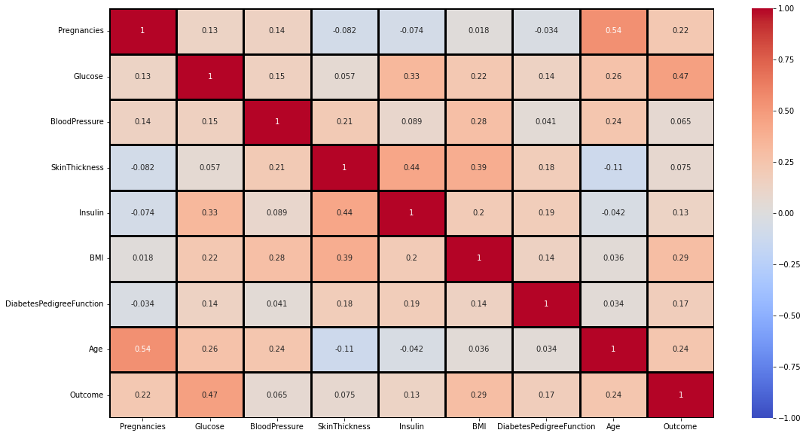
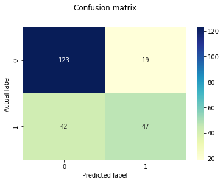

### Introduction 
- The logistic regression model, despite its name, is actually a linear model for classification. 

Logistic regression has the same main idea as linear regression. The difference is that this technique is used when the output or dependent variable is binary meaning the outcome can have only two possible values

## Types of Logistic Regression:
Binary Logistic Regression: The target variable has only two possible outcomes such as Spam or Not Spam, Cancer or No Cancer.

Multinomial Logistic Regression: The target variable has three or more nominal categories such as predicting the type of Wine.

Ordinal Logistic Regression: the target variable has three or more ordinal categories such as restaurant or product rating from 1 to 5.

## Diabetes Logistic Regression Prediction

## DataSet Details


Pregnancies decribes the number of times the person has been pregnant.

Glucose describes the blood glucose level on testing.

Blood pressure describes the diastolic blood pressure.

Skin Thickenss describes the skin fold thickness of the triceps.

Insulin describes the amount of insulin in a 2hour serum test.

BMI describes he body mass index.

DiabetesPedigreeFunction describes the family history of the person.

Age describes the age of the person.

Outcome describes if the person is predicted to have diabetes or not.


## Import Libraries


```python
import pandas as pd
import matplotlib.pyplot as plt
import seaborn as sns
import warnings
warnings.filterwarnings("ignore", category=DeprecationWarning) 
```

## Loading the dataset


```python
df=pd.read_csv('diabetes.csv')
```


```python
df.head(5)
```


<div>
<style scoped>
    .dataframe tbody tr th:only-of-type {
        vertical-align: middle;
    }

    .dataframe tbody tr th {
        vertical-align: top;
    }

    .dataframe thead th {
        text-align: right;
    }
</style>
<table border="1" class="dataframe">
  <thead>
    <tr style="text-align: right;">
      <th></th>
      <th>Pregnancies</th>
      <th>Glucose</th>
      <th>BloodPressure</th>
      <th>SkinThickness</th>
      <th>Insulin</th>
      <th>BMI</th>
      <th>DiabetesPedigreeFunction</th>
      <th>Age</th>
      <th>Outcome</th>
    </tr>
  </thead>
  <tbody>
    <tr>
      <th>0</th>
      <td>6</td>
      <td>148</td>
      <td>72</td>
      <td>35</td>
      <td>0</td>
      <td>33.6</td>
      <td>0.627</td>
      <td>50</td>
      <td>1</td>
    </tr>
    <tr>
      <th>1</th>
      <td>1</td>
      <td>85</td>
      <td>66</td>
      <td>29</td>
      <td>0</td>
      <td>26.6</td>
      <td>0.351</td>
      <td>31</td>
      <td>0</td>
    </tr>
    <tr>
      <th>2</th>
      <td>8</td>
      <td>183</td>
      <td>64</td>
      <td>0</td>
      <td>0</td>
      <td>23.3</td>
      <td>0.672</td>
      <td>32</td>
      <td>1</td>
    </tr>
    <tr>
      <th>3</th>
      <td>1</td>
      <td>89</td>
      <td>66</td>
      <td>23</td>
      <td>94</td>
      <td>28.1</td>
      <td>0.167</td>
      <td>21</td>
      <td>0</td>
    </tr>
    <tr>
      <th>4</th>
      <td>0</td>
      <td>137</td>
      <td>40</td>
      <td>35</td>
      <td>168</td>
      <td>43.1</td>
      <td>2.288</td>
      <td>33</td>
      <td>1</td>
    </tr>
  </tbody>
</table>
</div>


## Data Exploration


```python
## check rows and columns
df.shape
```


    (768, 9)


```python
df.dtypes
```


    Pregnancies                   int64
    Glucose                       int64
    BloodPressure                 int64
    SkinThickness                 int64
    Insulin                       int64
    BMI                         float64
    DiabetesPedigreeFunction    float64
    Age                           int64
    Outcome                       int64
    dtype: object


```python
# Check if there are any missing values
df.isnull().sum()
```


    Pregnancies                 0
    Glucose                     0
    BloodPressure               0
    SkinThickness               0
    Insulin                     0
    BMI                         0
    DiabetesPedigreeFunction    0
    Age                         0
    Outcome                     0
    dtype: int64


```python
df.columns
```


    Index(['Pregnancies', 'Glucose', 'BloodPressure', 'SkinThickness', 'Insulin',
           'BMI', 'DiabetesPedigreeFunction', 'Age', 'Outcome'],
          dtype='object')


### HeatMap


```python
fig, ax = plt.subplots(figsize = (18, 10))
#cbar_kws= {'orientation': 'horizontal'}
sns.heatmap(df.corr(),annot=True,vmin=-1, vmax=1, center= 0,cmap= 'coolwarm',linewidths=3, linecolor='black', )
```


    <AxesSubplot:>


    

    


## Machine Learning


```python
## Import ML libraries
from sklearn.model_selection import train_test_split
from sklearn.linear_model import LogisticRegression
from sklearn.metrics import classification_report
from sklearn.preprocessing import StandardScaler

import pickle
```


```python
X = df.drop(['Outcome'], axis=1)
y = df['Outcome']
```


```python
from sklearn.model_selection import train_test_split
X_train,X_test,y_train,y_test = train_test_split(X,y,random_state=40,test_size = 0.3)
```


```python
from sklearn.linear_model import LogisticRegression
lg = LogisticRegression()
```


```python
lg.fit(X_train,y_train)
```

    C:\Users\jnngugi\AppData\Roaming\Python\Python37\site-packages\sklearn\linear_model\_logistic.py:764: ConvergenceWarning: lbfgs failed to converge (status=1):
    STOP: TOTAL NO. of ITERATIONS REACHED LIMIT.
    
    Increase the number of iterations (max_iter) or scale the data as shown in:
        https://scikit-learn.org/stable/modules/preprocessing.html
    Please also refer to the documentation for alternative solver options:
        https://scikit-learn.org/stable/modules/linear_model.html#logistic-regression
      extra_warning_msg=_LOGISTIC_SOLVER_CONVERGENCE_MSG)
    


    LogisticRegression()


```python
y_pred = lg.predict(X_test)
y_pred
```


    array([1, 0, 1, 0, 0, 0, 1, 1, 0, 0, 0, 1, 0, 0, 0, 1, 0, 0, 0, 0, 1, 0,
           1, 1, 1, 0, 1, 0, 0, 1, 0, 0, 0, 0, 0, 0, 0, 0, 1, 1, 1, 1, 0, 0,
           0, 1, 0, 0, 0, 0, 0, 0, 0, 1, 1, 0, 0, 1, 1, 0, 0, 0, 0, 0, 0, 0,
           0, 0, 1, 0, 0, 0, 0, 0, 0, 1, 0, 0, 1, 1, 0, 1, 0, 0, 0, 0, 0, 0,
           1, 0, 0, 1, 0, 0, 0, 1, 0, 0, 0, 0, 0, 0, 0, 0, 0, 0, 1, 0, 0, 0,
           1, 0, 1, 0, 0, 0, 0, 0, 1, 0, 0, 0, 0, 0, 0, 0, 1, 1, 1, 0, 0, 0,
           0, 0, 1, 0, 0, 0, 0, 1, 0, 0, 0, 1, 1, 1, 0, 1, 0, 0, 1, 0, 0, 0,
           1, 0, 0, 0, 0, 0, 0, 0, 0, 1, 0, 0, 0, 0, 0, 1, 0, 0, 1, 0, 0, 0,
           1, 1, 1, 1, 1, 0, 1, 0, 0, 0, 0, 0, 0, 0, 0, 0, 0, 0, 0, 0, 0, 1,
           1, 1, 0, 0, 0, 1, 0, 1, 1, 1, 1, 1, 1, 0, 0, 0, 1, 0, 0, 0, 0, 0,
           1, 0, 0, 0, 1, 0, 0, 0, 0, 0, 0], dtype=int64)


```python
print(classification_report(y_test, y_pred))
```

                  precision    recall  f1-score   support
    
               0       0.75      0.87      0.80       142
               1       0.71      0.53      0.61        89
    
        accuracy                           0.74       231
       macro avg       0.73      0.70      0.70       231
    weighted avg       0.73      0.74      0.73       231
    
    


```python
# confusion matrix
from sklearn import metrics
cnf_matrix = metrics.confusion_matrix(y_test, y_pred)
p = sns.heatmap(pd.DataFrame(cnf_matrix), annot=True, cmap="YlGnBu" ,fmt='g')
plt.title('Confusion matrix', y=1.1)
plt.ylabel('Actual label')
plt.xlabel('Predicted label')
```


    Text(0.5, 15.0, 'Predicted label')


    

    


```python
print(lg.predict([[1,103,30,38,83,43.3,0.183,33]]))
```

    [0]
    

https://www.youtube.com/watch?v=qWfzIYCvBqo


```python

```
