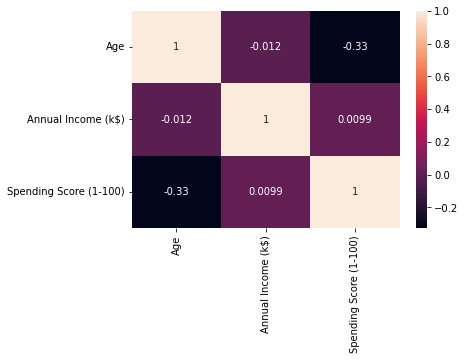
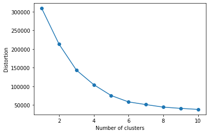
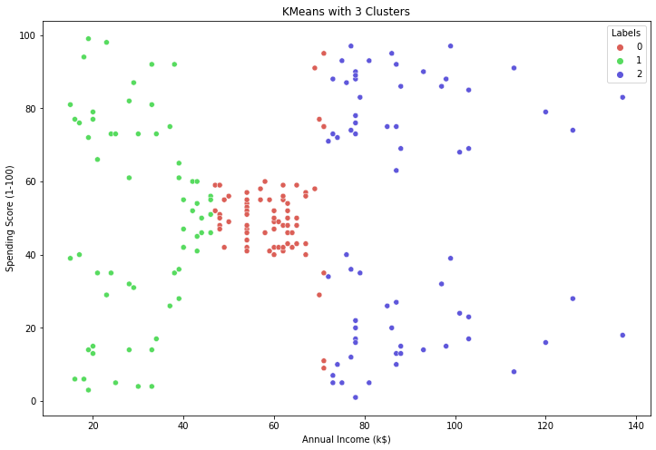

```python
import pandas as pd
import matplotlib.pyplot as plt
import numpy as np
import seaborn as sns
```


```python
df=pd.read_csv('Mall_Customers.csv')
```


```python
df.head()
```


<div>
<style scoped>
    .dataframe tbody tr th:only-of-type {
        vertical-align: middle;
    }

    .dataframe tbody tr th {
        vertical-align: top;
    }

    .dataframe thead th {
        text-align: right;
    }
</style>
<table border="1" class="dataframe">
  <thead>
    <tr style="text-align: right;">
      <th></th>
      <th>CustomerID</th>
      <th>Gender</th>
      <th>Age</th>
      <th>Annual Income (k$)</th>
      <th>Spending Score (1-100)</th>
    </tr>
  </thead>
  <tbody>
    <tr>
      <th>0</th>
      <td>1</td>
      <td>Male</td>
      <td>19</td>
      <td>15</td>
      <td>39</td>
    </tr>
    <tr>
      <th>1</th>
      <td>2</td>
      <td>Male</td>
      <td>21</td>
      <td>15</td>
      <td>81</td>
    </tr>
    <tr>
      <th>2</th>
      <td>3</td>
      <td>Female</td>
      <td>20</td>
      <td>16</td>
      <td>6</td>
    </tr>
    <tr>
      <th>3</th>
      <td>4</td>
      <td>Female</td>
      <td>23</td>
      <td>16</td>
      <td>77</td>
    </tr>
    <tr>
      <th>4</th>
      <td>5</td>
      <td>Female</td>
      <td>31</td>
      <td>17</td>
      <td>40</td>
    </tr>
  </tbody>
</table>
</div>


```python
df.shape
```


    (200, 5)


```python
df.isnull().sum()
```


    CustomerID                0
    Gender                    0
    Age                       0
    Annual Income (k$)        0
    Spending Score (1-100)    0
    dtype: int64


```python
df.info()
```


```python
# 0 means rows
# 1 means column
```


```python
df1 = df.drop('CustomerID', axis=1)
```


```python
df1.columns
```


    Index(['Gender', 'Age', 'Annual Income (k$)', 'Spending Score (1-100)'], dtype='object')


```python
# Transpose
df1.describe().T
```


<div>
<style scoped>
    .dataframe tbody tr th:only-of-type {
        vertical-align: middle;
    }

    .dataframe tbody tr th {
        vertical-align: top;
    }

    .dataframe thead th {
        text-align: right;
    }
</style>
<table border="1" class="dataframe">
  <thead>
    <tr style="text-align: right;">
      <th></th>
      <th>count</th>
      <th>mean</th>
      <th>std</th>
      <th>min</th>
      <th>25%</th>
      <th>50%</th>
      <th>75%</th>
      <th>max</th>
    </tr>
  </thead>
  <tbody>
    <tr>
      <th>Age</th>
      <td>200.0</td>
      <td>38.85</td>
      <td>13.969007</td>
      <td>18.0</td>
      <td>28.75</td>
      <td>36.0</td>
      <td>49.0</td>
      <td>70.0</td>
    </tr>
    <tr>
      <th>Annual Income (k$)</th>
      <td>200.0</td>
      <td>60.56</td>
      <td>26.264721</td>
      <td>15.0</td>
      <td>41.50</td>
      <td>61.5</td>
      <td>78.0</td>
      <td>137.0</td>
    </tr>
    <tr>
      <th>Spending Score (1-100)</th>
      <td>200.0</td>
      <td>50.20</td>
      <td>25.823522</td>
      <td>1.0</td>
      <td>34.75</td>
      <td>50.0</td>
      <td>73.0</td>
      <td>99.0</td>
    </tr>
  </tbody>
</table>
</div>


```python
# Investigate all the elements whithin each Feature 

for column in df:
    unique_vals = np.unique(df[column])
    nr_values = len(unique_vals)
    if nr_values < 12:
        print('The number of values for feature {} :{} -- {}'.format(column, nr_values,unique_vals))
    else:
        print('The number of values for feature {} :{}'.format(column, nr_values))
```

    The number of values for feature CustomerID :200
    The number of values for feature Gender :2 -- ['Female' 'Male']
    The number of values for feature Age :51
    The number of values for feature Annual Income (k$) :64
    The number of values for feature Spending Score (1-100) :84
    


```python
df['Gender'].value_counts()
```


    Female    112
    Male       88
    Name: Gender, dtype: int64


```python
sns.heatmap(df1.corr(),annot=True)
```


    <AxesSubplot:>


    

    


```python
from sklearn import preprocessing
```


```python
df1.head()
```


<div>
<style scoped>
    .dataframe tbody tr th:only-of-type {
        vertical-align: middle;
    }

    .dataframe tbody tr th {
        vertical-align: top;
    }

    .dataframe thead th {
        text-align: right;
    }
</style>
<table border="1" class="dataframe">
  <thead>
    <tr style="text-align: right;">
      <th></th>
      <th>Gender</th>
      <th>Age</th>
      <th>Annual Income (k$)</th>
      <th>Spending Score (1-100)</th>
    </tr>
  </thead>
  <tbody>
    <tr>
      <th>0</th>
      <td>Male</td>
      <td>19</td>
      <td>15</td>
      <td>39</td>
    </tr>
    <tr>
      <th>1</th>
      <td>Male</td>
      <td>21</td>
      <td>15</td>
      <td>81</td>
    </tr>
    <tr>
      <th>2</th>
      <td>Female</td>
      <td>20</td>
      <td>16</td>
      <td>6</td>
    </tr>
    <tr>
      <th>3</th>
      <td>Female</td>
      <td>23</td>
      <td>16</td>
      <td>77</td>
    </tr>
    <tr>
      <th>4</th>
      <td>Female</td>
      <td>31</td>
      <td>17</td>
      <td>40</td>
    </tr>
  </tbody>
</table>
</div>


```python

enc_gend=preprocessing.LabelEncoder().fit_transform(df1.loc[: ,'Gender'])
```


```python
type(enc_gend)
```


    numpy.ndarray


```python
print(enc_gend)
```

    [1 1 0 0 0 0 0 0 1 0 1 0 0 0 1 1 0 1 1 0 1 1 0 1 0 1 0 1 0 0 1 0 1 1 0 0 0
     0 0 0 0 1 1 0 0 0 0 0 0 0 0 1 0 1 0 1 0 1 0 1 1 1 0 0 1 1 0 0 1 0 1 0 0 0
     1 1 0 1 0 0 1 1 1 0 0 1 0 0 0 0 0 1 1 0 0 1 0 0 1 1 0 0 1 1 1 0 0 1 1 1 1
     0 0 1 0 0 0 0 0 0 1 0 0 1 0 0 1 1 1 1 1 1 0 0 1 0 0 1 1 0 0 1 0 0 1 1 1 0
     0 1 1 1 0 0 0 0 1 0 1 0 0 0 1 0 1 0 1 0 0 1 1 1 1 1 0 0 1 1 1 1 0 0 1 0 0
     1 0 1 0 0 0 0 1 0 0 0 0 1 1 1]
    


```python
gender=pd.DataFrame(data=enc_gend, columns=["new_gender"])
```


```python
gender
```


<div>
<style scoped>
    .dataframe tbody tr th:only-of-type {
        vertical-align: middle;
    }

    .dataframe tbody tr th {
        vertical-align: top;
    }

    .dataframe thead th {
        text-align: right;
    }
</style>
<table border="1" class="dataframe">
  <thead>
    <tr style="text-align: right;">
      <th></th>
      <th>new_gender</th>
    </tr>
  </thead>
  <tbody>
    <tr>
      <th>0</th>
      <td>1</td>
    </tr>
    <tr>
      <th>1</th>
      <td>1</td>
    </tr>
    <tr>
      <th>2</th>
      <td>0</td>
    </tr>
    <tr>
      <th>3</th>
      <td>0</td>
    </tr>
    <tr>
      <th>4</th>
      <td>0</td>
    </tr>
    <tr>
      <th>...</th>
      <td>...</td>
    </tr>
    <tr>
      <th>195</th>
      <td>0</td>
    </tr>
    <tr>
      <th>196</th>
      <td>0</td>
    </tr>
    <tr>
      <th>197</th>
      <td>1</td>
    </tr>
    <tr>
      <th>198</th>
      <td>1</td>
    </tr>
    <tr>
      <th>199</th>
      <td>1</td>
    </tr>
  </tbody>
</table>
<p>200 rows × 1 columns</p>
</div>


```python
df1["Gender"] = gender
```


```python
df1.head()
```


<div>
<style scoped>
    .dataframe tbody tr th:only-of-type {
        vertical-align: middle;
    }

    .dataframe tbody tr th {
        vertical-align: top;
    }

    .dataframe thead th {
        text-align: right;
    }
</style>
<table border="1" class="dataframe">
  <thead>
    <tr style="text-align: right;">
      <th></th>
      <th>Gender</th>
      <th>Age</th>
      <th>Annual Income (k$)</th>
      <th>Spending Score (1-100)</th>
    </tr>
  </thead>
  <tbody>
    <tr>
      <th>0</th>
      <td>1</td>
      <td>19</td>
      <td>15</td>
      <td>39</td>
    </tr>
    <tr>
      <th>1</th>
      <td>1</td>
      <td>21</td>
      <td>15</td>
      <td>81</td>
    </tr>
    <tr>
      <th>2</th>
      <td>0</td>
      <td>20</td>
      <td>16</td>
      <td>6</td>
    </tr>
    <tr>
      <th>3</th>
      <td>0</td>
      <td>23</td>
      <td>16</td>
      <td>77</td>
    </tr>
    <tr>
      <th>4</th>
      <td>0</td>
      <td>31</td>
      <td>17</td>
      <td>40</td>
    </tr>
  </tbody>
</table>
</div>


```python
X = df1
```


```python
X
```


<div>
<style scoped>
    .dataframe tbody tr th:only-of-type {
        vertical-align: middle;
    }

    .dataframe tbody tr th {
        vertical-align: top;
    }

    .dataframe thead th {
        text-align: right;
    }
</style>
<table border="1" class="dataframe">
  <thead>
    <tr style="text-align: right;">
      <th></th>
      <th>Gender</th>
      <th>Age</th>
      <th>Annual Income (k$)</th>
      <th>Spending Score (1-100)</th>
    </tr>
  </thead>
  <tbody>
    <tr>
      <th>0</th>
      <td>1</td>
      <td>19</td>
      <td>15</td>
      <td>39</td>
    </tr>
    <tr>
      <th>1</th>
      <td>1</td>
      <td>21</td>
      <td>15</td>
      <td>81</td>
    </tr>
    <tr>
      <th>2</th>
      <td>0</td>
      <td>20</td>
      <td>16</td>
      <td>6</td>
    </tr>
    <tr>
      <th>3</th>
      <td>0</td>
      <td>23</td>
      <td>16</td>
      <td>77</td>
    </tr>
    <tr>
      <th>4</th>
      <td>0</td>
      <td>31</td>
      <td>17</td>
      <td>40</td>
    </tr>
    <tr>
      <th>...</th>
      <td>...</td>
      <td>...</td>
      <td>...</td>
      <td>...</td>
    </tr>
    <tr>
      <th>195</th>
      <td>0</td>
      <td>35</td>
      <td>120</td>
      <td>79</td>
    </tr>
    <tr>
      <th>196</th>
      <td>0</td>
      <td>45</td>
      <td>126</td>
      <td>28</td>
    </tr>
    <tr>
      <th>197</th>
      <td>1</td>
      <td>32</td>
      <td>126</td>
      <td>74</td>
    </tr>
    <tr>
      <th>198</th>
      <td>1</td>
      <td>32</td>
      <td>137</td>
      <td>18</td>
    </tr>
    <tr>
      <th>199</th>
      <td>1</td>
      <td>30</td>
      <td>137</td>
      <td>83</td>
    </tr>
  </tbody>
</table>
<p>200 rows × 4 columns</p>
</div>


## k-means


```python
from sklearn.cluster import KMeans

```


```python
fruits = ["apple", "banana", "cherry"]

fruits[2]
```


    'cherry'


```python
x=
```


```python
# create a variable name to hold your list
my_list=[]


for i in range(1,11):
    km=KMeans(n_clusters=i,random_state=42)
    km.fit(df1)
    my_list.append(km.inertia_)
    
    
    
```


```python
my_list
```


    [308862.06,
     212889.44245524297,
     143391.5923603568,
     104414.67534220166,
     75427.71182424155,
     58348.64136331505,
     51575.27793107793,
     44359.63464114833,
     40942.511170061174,
     37515.84125504126]


```python
import matplotlib.pyplot as plt
```


```python
mylist = []
for i in range(1, 11):
    km = KMeans(
        n_clusters=i, init='random', random_state=0 )
    km.fit(df1)
    mylist.append(km.inertia_)

# plot
plt.plot(range(1, 11), mylist, marker='o')
plt.xlabel('Number of clusters')
plt.ylabel('Distortion')
plt.show()
```


    

    


##  Inertia

Inertia is Inertia measures how well a dataset was clustered by K-Means. It is calculated by measuring the distance between each data point and its centroid, squaring this distance, and summing these squares across one cluster.

A good model is one with low inertia AND a low number of clusters (K). However, this is a tradeoff because as K increases, inertia decreases.

To find the optimal K for a dataset, use the Elbow method; find the point where the decrease in inertia begins to slow. K=3 is the “elbow” of this graph.


```python
no_of_clusters = range(2,10)
inertia = []


for f in no_of_clusters:
    kmeans = KMeans(n_clusters=f, random_state=0)
    kmeans = kmeans.fit(X)
    u = kmeans.inertia_
    inertia.append(u)
    print("The innertia for :", f, "Clusters is:", u)
```

    The innertia for : 2 Clusters is: 387065.7137713772
    The innertia for : 3 Clusters is: 271384.50878286787
    The innertia for : 4 Clusters is: 195401.19855991477
    The innertia for : 5 Clusters is: 157183.29637394776
    The innertia for : 6 Clusters is: 122630.44175335614
    The innertia for : 7 Clusters is: 103233.01724386725
    The innertia for : 8 Clusters is: 86053.67444777439
    The innertia for : 9 Clusters is: 76915.6613507064
    


```python
import numpy as np
```


```python
kmeans = KMeans(n_clusters=3, random_state=43)
kmeans = kmeans.fit(df1)
predictions = kmeans.predict(df1)

# calculating the Counts of the cluster
unique, prediction_count = np.unique(predictions, return_counts=True)
counts = prediction_count.reshape(1,3)

# Creating a dataframe
counts_df1 = pd.DataFrame(counts, columns = ["Cluster 0","Cluster 1","Cluster 2"])

# Prints the clusters it assigned to each observation
##print("The clusters are: ", kmeans.labels_)

# Prints the Inertia
#print("The Inertia is: ", kmeans.inertia_)
```


```python
counts_df
```


<div>
<style scoped>
    .dataframe tbody tr th:only-of-type {
        vertical-align: middle;
    }

    .dataframe tbody tr th {
        vertical-align: top;
    }

    .dataframe thead th {
        text-align: right;
    }
</style>
<table border="1" class="dataframe">
  <thead>
    <tr style="text-align: right;">
      <th></th>
      <th>Cluster 0</th>
      <th>Cluster 1</th>
      <th>Cluster 2</th>
    </tr>
  </thead>
  <tbody>
    <tr>
      <th>0</th>
      <td>123</td>
      <td>38</td>
      <td>39</td>
    </tr>
  </tbody>
</table>
</div>


```python
unique
```


    array([0, 1, 2])


```python
prediction_count
```


    array([123,  38,  39], dtype=int64)


```python
predictions
```


    array([0, 0, 0, 0, 0, 0, 0, 0, 0, 0, 0, 0, 0, 0, 0, 0, 0, 0, 0, 0, 0, 0,
           0, 0, 0, 0, 0, 0, 0, 0, 0, 0, 0, 0, 0, 0, 0, 0, 0, 0, 0, 0, 0, 0,
           0, 0, 0, 0, 0, 0, 0, 0, 0, 0, 0, 0, 0, 0, 0, 0, 0, 0, 0, 0, 0, 0,
           0, 0, 0, 0, 0, 0, 0, 0, 0, 0, 0, 0, 0, 0, 0, 0, 0, 0, 0, 0, 0, 0,
           0, 0, 0, 0, 0, 0, 0, 0, 0, 0, 0, 0, 0, 0, 0, 0, 0, 0, 0, 0, 0, 0,
           0, 0, 0, 0, 0, 0, 0, 0, 0, 0, 0, 0, 0, 2, 1, 2, 1, 2, 1, 2, 1, 2,
           1, 2, 1, 2, 1, 2, 1, 2, 1, 2, 1, 2, 1, 2, 1, 2, 1, 2, 1, 2, 1, 2,
           1, 2, 1, 2, 1, 2, 1, 2, 1, 2, 1, 2, 1, 2, 1, 2, 1, 2, 1, 2, 1, 2,
           1, 2, 1, 2, 1, 2, 1, 2, 1, 2, 1, 2, 1, 2, 1, 2, 1, 2, 1, 2, 1, 2,
           1, 2])


```python

kmeans = KMeans(n_clusters=3, random_state=0)
kmeans = kmeans.fit(df1)


kmeans.labels_

# "predictions" for new data
predictions = kmeans.predict(df1)

# calculating the Counts of the cluster
unique, counts = np.unique(predictions, return_counts=True)
counts = counts.reshape(1,3)

# Creating a datagrame
countscldf = pd.DataFrame(counts, columns = ["Cluster 0","Cluster 1","Cluster 2"])

# display
countscldf

```


<div>
<style scoped>
    .dataframe tbody tr th:only-of-type {
        vertical-align: middle;
    }

    .dataframe tbody tr th {
        vertical-align: top;
    }

    .dataframe thead th {
        text-align: right;
    }
</style>
<table border="1" class="dataframe">
  <thead>
    <tr style="text-align: right;">
      <th></th>
      <th>Cluster 0</th>
      <th>Cluster 1</th>
      <th>Cluster 2</th>
    </tr>
  </thead>
  <tbody>
    <tr>
      <th>0</th>
      <td>38</td>
      <td>39</td>
      <td>123</td>
    </tr>
  </tbody>
</table>
</div>


```python
predictions
```


    array([2, 2, 2, 2, 2, 2, 2, 2, 2, 2, 2, 2, 2, 2, 2, 2, 2, 2, 2, 2, 2, 2,
           2, 2, 2, 2, 2, 2, 2, 2, 2, 2, 2, 2, 2, 2, 2, 2, 2, 2, 2, 2, 2, 2,
           2, 2, 2, 2, 2, 2, 2, 2, 2, 2, 2, 2, 2, 2, 2, 2, 2, 2, 2, 2, 2, 2,
           2, 2, 2, 2, 2, 2, 2, 2, 2, 2, 2, 2, 2, 2, 2, 2, 2, 2, 2, 2, 2, 2,
           2, 2, 2, 2, 2, 2, 2, 2, 2, 2, 2, 2, 2, 2, 2, 2, 2, 2, 2, 2, 2, 2,
           2, 2, 2, 2, 2, 2, 2, 2, 2, 2, 2, 2, 2, 1, 0, 1, 0, 1, 0, 1, 0, 1,
           0, 1, 0, 1, 0, 1, 0, 1, 0, 1, 0, 1, 0, 1, 0, 1, 0, 1, 0, 1, 0, 1,
           0, 1, 0, 1, 0, 1, 0, 1, 0, 1, 0, 1, 0, 1, 0, 1, 0, 1, 0, 1, 0, 1,
           0, 1, 0, 1, 0, 1, 0, 1, 0, 1, 0, 1, 0, 1, 0, 1, 0, 1, 0, 1, 0, 1,
           0, 1])


```python
clusters = kmeans.labels_
```


```python

df['Clusters'] = clusters

# Creating a cluster Category
df['Clusters Category'] = 'No Data'
df['Clusters Category'].loc[df['Clusters'] == 0] = 'Cluster 1'
df['Clusters Category'].loc[df['Clusters'] == 1] = 'Cluster 2'
df['Clusters Category'].loc[df['Clusters'] == 2] = 'Cluster 3'


df.head(5)
```

    C:\Users\ngugi\AppData\Local\Temp\ipykernel_32212\49891857.py:5: SettingWithCopyWarning: 
    A value is trying to be set on a copy of a slice from a DataFrame
    
    See the caveats in the documentation: https://pandas.pydata.org/pandas-docs/stable/user_guide/indexing.html#returning-a-view-versus-a-copy
      df['Clusters Category'].loc[df['Clusters'] == 0] = 'Cluster 1'
    C:\Users\ngugi\AppData\Local\Temp\ipykernel_32212\49891857.py:6: SettingWithCopyWarning: 
    A value is trying to be set on a copy of a slice from a DataFrame
    
    See the caveats in the documentation: https://pandas.pydata.org/pandas-docs/stable/user_guide/indexing.html#returning-a-view-versus-a-copy
      df['Clusters Category'].loc[df['Clusters'] == 1] = 'Cluster 2'
    C:\Users\ngugi\AppData\Local\Temp\ipykernel_32212\49891857.py:7: SettingWithCopyWarning: 
    A value is trying to be set on a copy of a slice from a DataFrame
    
    See the caveats in the documentation: https://pandas.pydata.org/pandas-docs/stable/user_guide/indexing.html#returning-a-view-versus-a-copy
      df['Clusters Category'].loc[df['Clusters'] == 2] = 'Cluster 3'
    


<div>
<style scoped>
    .dataframe tbody tr th:only-of-type {
        vertical-align: middle;
    }

    .dataframe tbody tr th {
        vertical-align: top;
    }

    .dataframe thead th {
        text-align: right;
    }
</style>
<table border="1" class="dataframe">
  <thead>
    <tr style="text-align: right;">
      <th></th>
      <th>CustomerID</th>
      <th>Gender</th>
      <th>Age</th>
      <th>Annual Income (k$)</th>
      <th>Spending Score (1-100)</th>
      <th>Clusters</th>
      <th>Clusters Category</th>
    </tr>
  </thead>
  <tbody>
    <tr>
      <th>0</th>
      <td>1</td>
      <td>Male</td>
      <td>19</td>
      <td>15</td>
      <td>39</td>
      <td>2</td>
      <td>Cluster 3</td>
    </tr>
    <tr>
      <th>1</th>
      <td>2</td>
      <td>Male</td>
      <td>21</td>
      <td>15</td>
      <td>81</td>
      <td>2</td>
      <td>Cluster 3</td>
    </tr>
    <tr>
      <th>2</th>
      <td>3</td>
      <td>Female</td>
      <td>20</td>
      <td>16</td>
      <td>6</td>
      <td>2</td>
      <td>Cluster 3</td>
    </tr>
    <tr>
      <th>3</th>
      <td>4</td>
      <td>Female</td>
      <td>23</td>
      <td>16</td>
      <td>77</td>
      <td>2</td>
      <td>Cluster 3</td>
    </tr>
    <tr>
      <th>4</th>
      <td>5</td>
      <td>Female</td>
      <td>31</td>
      <td>17</td>
      <td>40</td>
      <td>2</td>
      <td>Cluster 3</td>
    </tr>
  </tbody>
</table>
</div>


```python
https://zindi.africa/competitions/data-science-nigeria-challenge-1-loan-default-prediction/data

X['Labels'] = kmeans.labels_
plt.figure(figsize=(12, 8))
sns.scatterplot(data= X, x=X['Annual Income (k$)'], y=X['Spending Score (1-100)'], hue=X['Labels'], 
                palette=sns.color_palette('hls', 3))
plt.title('KMeans with 3 Clusters')
plt.show()
```


    

    


### Conclusion

Label 0 is mid income and mid spending

Label 1 is high income and high spending

Label 2 is low income and low spending

Label 3 is high income and low spending

Label 4 is low income and high spending

## What next after customer segmenting?

https://contensis.uwaterloo.ca/sites/courses-archive/1191/ECON-344-ARBUS-302/lecture-content/module-2/week-6-2.aspx


```python
df.to_csv('Cluster_Output.csv')
```


```python
df.sample(10)
```


<div>
<style scoped>
    .dataframe tbody tr th:only-of-type {
        vertical-align: middle;
    }

    .dataframe tbody tr th {
        vertical-align: top;
    }

    .dataframe thead th {
        text-align: right;
    }
</style>
<table border="1" class="dataframe">
  <thead>
    <tr style="text-align: right;">
      <th></th>
      <th>CustomerID</th>
      <th>Gender</th>
      <th>Age</th>
      <th>Annual Income (k$)</th>
      <th>Spending Score (1-100)</th>
      <th>Clusters</th>
      <th>Clusters Category</th>
    </tr>
  </thead>
  <tbody>
    <tr>
      <th>163</th>
      <td>164</td>
      <td>Female</td>
      <td>31</td>
      <td>81</td>
      <td>93</td>
      <td>1</td>
      <td>Cluster 2</td>
    </tr>
    <tr>
      <th>108</th>
      <td>109</td>
      <td>Male</td>
      <td>68</td>
      <td>63</td>
      <td>43</td>
      <td>2</td>
      <td>Cluster 3</td>
    </tr>
    <tr>
      <th>155</th>
      <td>156</td>
      <td>Female</td>
      <td>27</td>
      <td>78</td>
      <td>89</td>
      <td>1</td>
      <td>Cluster 2</td>
    </tr>
    <tr>
      <th>21</th>
      <td>22</td>
      <td>Male</td>
      <td>25</td>
      <td>24</td>
      <td>73</td>
      <td>2</td>
      <td>Cluster 3</td>
    </tr>
    <tr>
      <th>136</th>
      <td>137</td>
      <td>Female</td>
      <td>44</td>
      <td>73</td>
      <td>7</td>
      <td>0</td>
      <td>Cluster 1</td>
    </tr>
    <tr>
      <th>53</th>
      <td>54</td>
      <td>Male</td>
      <td>59</td>
      <td>43</td>
      <td>60</td>
      <td>2</td>
      <td>Cluster 3</td>
    </tr>
    <tr>
      <th>86</th>
      <td>87</td>
      <td>Female</td>
      <td>55</td>
      <td>57</td>
      <td>58</td>
      <td>2</td>
      <td>Cluster 3</td>
    </tr>
    <tr>
      <th>112</th>
      <td>113</td>
      <td>Female</td>
      <td>38</td>
      <td>64</td>
      <td>42</td>
      <td>2</td>
      <td>Cluster 3</td>
    </tr>
    <tr>
      <th>23</th>
      <td>24</td>
      <td>Male</td>
      <td>31</td>
      <td>25</td>
      <td>73</td>
      <td>2</td>
      <td>Cluster 3</td>
    </tr>
    <tr>
      <th>55</th>
      <td>56</td>
      <td>Male</td>
      <td>47</td>
      <td>43</td>
      <td>41</td>
      <td>2</td>
      <td>Cluster 3</td>
    </tr>
  </tbody>
</table>
</div>


```python
print (range(1,30))
```

    range(1, 30)
    
